<div align="center">



<br />

### I build dependable software for radiation oncology.

Clinical operations, treatment-planning research, safety systems, and technical education—translated into tools people can actually use.

[](https://www.linkedin.com/in/ara-alexandrian/)
[](mailto:ara.n.alexandrian@gmail.com)
[](https://marybird.org/)

</div>

---

## What I work on

I’m a medical physicist and software developer working where clinical judgment, data, and automation meet. My projects range from focused utilities to full-stack platforms, with an emphasis on traceability, human-centered workflows, and maintainable systems.

| Clinical software | Research engineering | Knowledge systems |
| :--- | :--- | :--- |
| Workflow tools, equipment tracking, QA support, and safety-focused applications. | DICOM pipelines, dose analysis, treatment-planning research, and reproducible analytics. | Interactive teaching tools, workflow documentation, and AI-assisted information systems. |

> **Design principle:** software in medicine should reduce ambiguity—not introduce more of it.

## Selected public work

### [CT Metal Artifact Characterization](https://github.com/Ara-Alexandrian/DO_DD)

An interactive research application for detecting and characterizing metal artifacts in CT imaging. It combines multi-planar analysis, adaptive segmentation, visual quality checks, and research-ready exports for dataset development.

`Python` · `Streamlit` · `DICOM` · `Medical imaging`

### [Radiotherapy DICOM Workshop](https://github.com/Ara-Alexandrian/DICOM-Lecture-MBP_06162026)

A practical introduction to radiotherapy DICOM objects, supported by interactive tutorials and working viewer applications. Built to help learners move from file-format concepts to hands-on exploration.

`Python` · `DICOM` · `Jupyter` · `Education`

### [pyRadPlan](https://github.com/Ara-Alexandrian/pyRadPlan) & [matRad](https://github.com/Ara-Alexandrian/matRad)

Public work connected to open-source radiotherapy treatment-planning ecosystems, spanning Python and MATLAB tooling for research and education.

`Python` · `MATLAB` · `Optimization` · `Treatment planning`

## Selected private work

Much of my applied work lives in private repositories because it supports internal operations, active research, or systems that require careful handling. Representative areas include:

- **Clinical operations:** equipment lifecycle tracking, scheduling analytics, daily QA support, and procedure-specific workflow tools.
- **Safety and evaluation:** structured incident review, evaluator workflows, reliability analysis, and auditable feedback systems.
- **Imaging and treatment planning:** DICOM utilities, brachytherapy analysis, radiosurgery workflows, dose research, and simulation tooling.
- **Automation and AI:** local-first assistants, orchestration systems, document pipelines, and purpose-built interfaces for expert workflows.

Architecture notes, demonstrations, and code samples can be shared when project constraints allow.

## How I build

```text
Clinical question  →  explicit workflow  →  testable software  →  usable evidence
```

My default stack is Python for scientific and clinical computing, with JavaScript/Node.js for interactive systems and PostgreSQL, SQLite, Redis, or MongoDB chosen to fit the operational context. I use containers and reproducible environments where they improve handoff and reliability.

## Publications

- **Accuracy of Dose-Volume Metric Calculation for Small-Volume Radiosurgery Targets** — *Medical Physics*, 2020
- **An Open-Source Tool to Visualize Potential Cone Collisions While Planning SRS Cases** — *Journal of Applied Clinical Medical Physics*, 2020
- **Incorporating Biological Modeling Into Patient-Specific Plan Verification** — *Journal of Applied Clinical Medical Physics*, 2020

---

<div align="center">

**Medical physics × software engineering × practical systems**

Open to conversations about clinical tooling, research collaboration, and technical education.

</div>